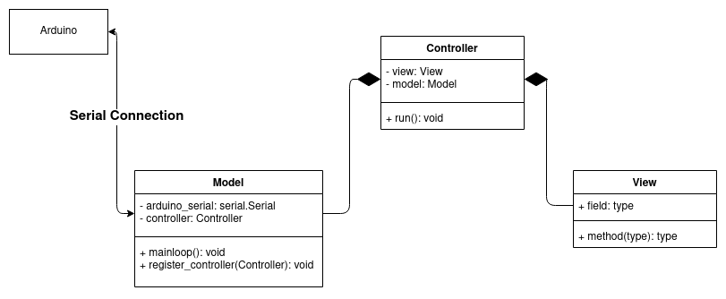

*By Szymon Duchniewicz*

# Project managment
The software of the project was managed through github.

# User Interface

The basic User Interface (further referred to as UI) utilises the Serial Monitor through which it communicates with the user, allowing for the values of the Temperature, RPM and PH to be set at the start of the program.

Our aim was to improve this, so communicating with the system is more intuitive and easier via a Graphical User Interface (GUI). The GUI was implemented in Python using the tkinter library.

## GUI Architecture

Below is a diagram explainining the high-level architecture. It is a UML diagram with an additional explanation of the communication between the Arduino (Simduino) and the Python script.

Icons used in App made by <a href="https://www.flaticon.com/authors/freepik" title="Freepik">Freepik</a> from <a href="https://www.flaticon.com/" title="Flaticon">www.flaticon.com</a>

## Possible improvements
Different control methods, e.g. manual control, PID control, Proportional control, bang bang add default automatic control

### Color scheme
https://coolors.co/ffead0-2e5266-aeadf0-47e5bc-93032e
