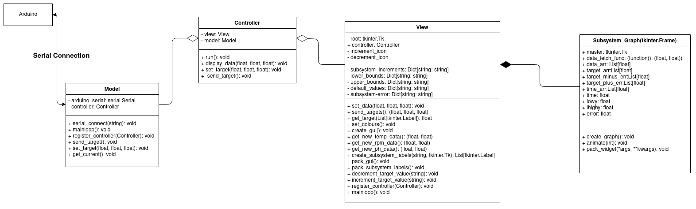

*By Szymon Duchniewicz*

# Project managment
The software of the project was managed through github.

## User Interface

The basic User Interface (further referred to as UI) utilises the Serial Monitor through which it communicates with the user, allowing for the values of the Temperature, RPM and PH to be set at the start of the program.

Our aim was to improve this, so communicating with the system is more intuitive and easier via a Graphical User Interface (GUI). The GUI was implemented in Python using the tkinter library.

### The GUI explained

On the left of the GUI there are labels explaining which subsystem's data is managed there, along with the 
target value for the subsystem, current value from the arduino sensors and buttons to increase/decrease the target value.

On the right there are 3 graphs stacked on top of each other, each one containing a solid line graph of the
current data and a dashed line graph of the target data on the Y axis, and time on the X axis (in seconds).
The graphs are updated and animated in real time.

## Program Architecture

The program utilises and MVC architecture (Model View Controller) to make the seperation of logic and the GUI
as clear as possible.
Below is a diagram explainining the high-level architecture. It is a UML diagram with an additional explanation of the communication between the Arduino (Simduino) and the Python script.

### Running everything concurrently

Because two infinite loops have to be run concurrently (GUI and Serial connection), the Serial connection is handled on a separate thread. Since there is a lot of waiting around for I/O commands, there is no need for a sparate process to be used here, as it would be an overkill.

Icons used in App made by <a href="https://www.flaticon.com/authors/freepik" title="Freepik">Freepik</a> from <a href="https://www.flaticon.com/" title="Flaticon">www.flaticon.com</a>

## Arduino-Python interface
The simAVR simulation arduino communicates with a Python script via a serial port. The messages are sent in ASCII,
as to make them easy to understand by a human when debugging. (And it really was necessary to understand it when debugging :) )
Each message, either from python or from arduino ends with an ENDLINE ASCII character (\n, character 10).

### Communication timings
Because the communication between arduino and python was not 100% reliable when the messages were sent as soon as they were available
(some messages got lost, or bugged out the whole connection) I decided that the python script will have full
control over how and when the messages get sent. The order is as follows:
- Python requests current data from the arduino (Current sensor values), by sending a "get current\n" command.
- Script sleeps for 0.2 seconds, waiting for arduino to process the data and send it over.
- Data is received and displayed.
- Script sleeps for 0.2 seconds to ensure the buffers are clear and not to overload the arduino.
- Script sends the current target values which are fetched from the View.
- Script sleeps for 0.2 seconds to ensure the buffers are clear and not to overload the arduino.

This process repeats in an infinite loop, until the connection is broken or the program is stopped.

## Possible improvements
Different control methods, e.g. manual control, PID control, Proportional control, bang bang add default automatic control
Color selecting for ease of use (nice view)

### Color scheme
https://coolors.co/ffead0-2e5266-aeadf0-47e5bc-93032e

SLIDE TEXT:

### Program architecture
- Uses Model View Controller Architecture
- Model communicates with Arduino via Serial connection
- Two loops running on separate threads

